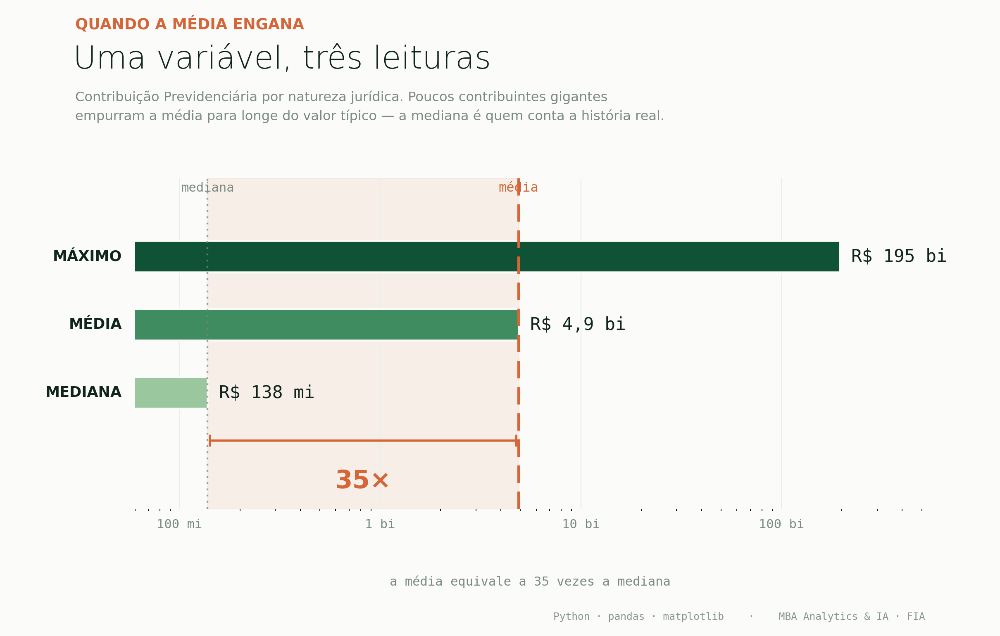
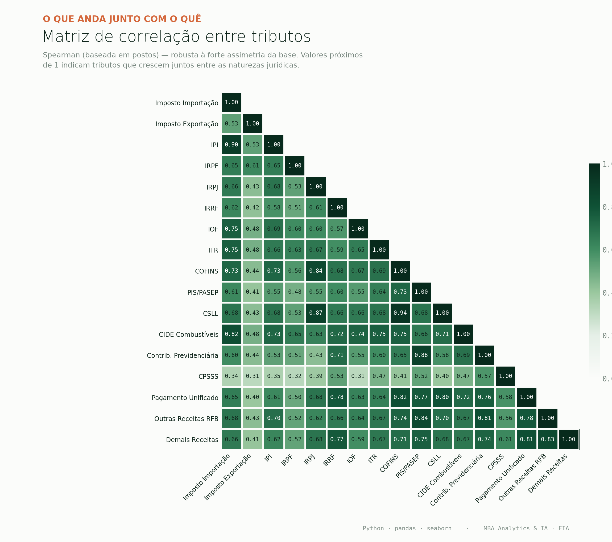

# 📊 Análise Exploratória da Arrecadação Federal (2024)

**🌐 Idioma / Language:** [Português](#-português) · [English](#-english)

---

## 🇧🇷 Português

Estudo de caso desenvolvido no **MBA em Analytics e Inteligência Artificial — Data Science / FIA**, com foco em análise exploratória de dados (EDA) aplicada à arrecadação tributária federal brasileira por natureza jurídica.

> De um desvio padrão de R$ 23 bilhões a três blocos de tributos que se movem juntos: como a estatística aplicada transforma uma base bruta em leitura de negócio.

### 🎯 Objetivo

Explorar a base de arrecadação federal para entender **como os diferentes tributos se distribuem e se relacionam** entre as naturezas jurídicas, identificando padrões, concentrações e correlações relevantes — e traduzindo achados estatísticos em leitura de negócio.

### ❓ Missão da análise

Uma consultoria tributária deseja entender o comportamento da arrecadação federal para subsidiar análises de risco fiscal e planejamento tributário. As perguntas a responder:

1. Como se distribui a arrecadação total entre os diferentes tributos e naturezas jurídicas?
2. Existe correlação entre diferentes tributos dentro de uma mesma natureza jurídica?
3. Há registros com valores atípicos que mereçam investigação mais detalhada?

### 📦 Base utilizada

Dados de arrecadação federal de 2024, organizados por **natureza jurídica** (código, descrição e escopo) e detalhados por tipo de tributo: Imposto de Importação, IPI, IRPF, IRPJ, IRRF, IOF, ITR, COFINS, PIS/PASEP, CSLL, CIDE-Combustíveis, Contribuição Previdenciária, entre outros.

> **Fonte:** base fornecida no MBA da FIA, com referência a dados abertos disponíveis em [Base dos Dados](https://basedosdados.org).

### 🔍 Etapas da análise

1. **Unicidade e preenchimento** — verificação de duplicidades e tratamento de valores ausentes.
2. **Análise univariada** — distribuição de cada tributo (medidas de tendência central, dispersão e forma).
3. **Detecção de valores atípicos** — boxplots e avaliação por percentis, com interpretação de negócio.
4. **Análise bivariada** — matriz de correlação de **Spearman** e gráficos de dispersão em escala logarítmica.
5. **Conclusões** — resposta direta às perguntas da missão.

### 💡 Principais insights

**Distribuição fortemente concentrada.** A arrecadação federal de 2024 (~R$ 1,65 trilhão) é dominada por poucos. Os 3 maiores tributos (Contribuição Previdenciária, IRRF e COFINS) somam ~57% do total, e 4 naturezas jurídicas concentram ~82% — com a Sociedade Empresária Limitada respondendo sozinha por ~45%.

**Valores extremos não são erro — são materialidade.** Os outliers identificados correspondem às grandes naturezas empresariais (Ltda e S.A.). Refletem comportamento legítimo de negócio e não devem ser descartados. A exceção é o Imposto de Exportação, documentado como variável de baixa capacidade informativa.

**A média, sozinha, engana.** Na Contribuição Previdenciária, a média (~R$ 4,9 bi) é cerca de **35× a mediana** (~R$ 138 mi). Por isso a escolha entre **Pearson e Spearman** é decisiva: numa base assimétrica, Spearman (baseada em postos) revela a relação real, enquanto Pearson se deixa dominar pelos extremos.

**Três blocos de tributos se movem juntos:**

| Bloco | Par em destaque | Correlação | Leitura |
|---|---|---|---|
| Lucro e faturamento | COFINS × CSLL | 0,94 | grande operação gera faturamento e lucro simultaneamente |
| Comércio exterior | Imposto Importação × IPI | 0,90 | tributação em cascata na importação |
| Folha de pagamento | PIS/PASEP × Contrib. Previdenciária | 0,88 | ambos ligados à remuneração e ao quadro de empregados |

### 📈 Visualizações

| Distribuição (média × mediana × máximo) | Matriz de correlação de Spearman |
|---|---|
|  |  |

### 🛠️ Ferramentas utilizadas

- **Python**
- **pandas** — manipulação e análise de dados
- **NumPy** — operações numéricas
- **matplotlib** e **seaborn** — visualização
- **Google Colab / Jupyter Notebook** — ambiente de desenvolvimento

### 📁 Estrutura do repositório

```
federal-tax-revenue-analysis/
│
├── data/          # base de dados utilizada
├── notebooks/     # notebook com a análise completa
├── images/        # graficos exportados
├── src/           # codigo auxiliar de visualizacao (.py)
├── README.md
└── requirements.txt
```

### ▶️ Como executar

1. Clone o repositório:
   ```bash
   git clone https://github.com/RenanCorreiaFaria/federal-tax-revenue-analysis.git
   ```
2. (Opcional) Instale as dependências:
   ```bash
   pip install -r requirements.txt
   ```
3. Abra o notebook em `notebooks/` no Google Colab ou Jupyter.
4. Garanta que o arquivo de dados em `data/` esteja acessível no caminho esperado.
5. Execute as células na ordem.

### 👥 Time

Estudo de caso desenvolvido em grupo no MBA em Analytics e IA / Data Science da FIA:

- Renan Correia de Faria (líder)
- Bruno Umeoka Higuti
- Hygor Vaz de Souza Barbosa
- Michelle Arisa Tanaka
- Victor Aquino

*A troca de ideias dentro do grupo foi parte essencial da qualidade da análise.*

---

## 🇬🇧 English

Case study developed during the **MBA in Analytics and Artificial Intelligence — Data Science / FIA**, focused on exploratory data analysis (EDA) applied to Brazilian federal tax revenue by legal entity type.

> From a standard deviation of R$ 23 billion to three clusters of taxes that move together: how applied statistics turns a raw dataset into business insight.

### 🎯 Goal

Explore the federal tax revenue dataset to understand **how different taxes are distributed and how they relate** across legal entity types, identifying patterns, concentrations, and relevant correlations — translating statistical findings into business reading.

### ❓ Analysis brief

A tax consultancy wants to understand the behavior of federal tax revenue to support fiscal risk analysis and tax planning. The questions to answer:

1. How is total revenue distributed across the different taxes and legal entity types?
2. Is there correlation between different taxes within the same legal entity type?
3. Are there records with atypical values that deserve closer investigation?

### 📦 Dataset

Brazilian federal tax revenue data for 2024, organized by **legal entity type** (code, description, and scope) and broken down by tax: Import Tax, IPI, IRPF, IRPJ, IRRF, IOF, ITR, COFINS, PIS/PASEP, CSLL, CIDE-Fuels, Social Security Contribution, and others.

> **Source:** dataset provided in the FIA MBA program, referencing open data available at [Base dos Dados](https://basedosdados.org).

### 🔍 Analysis steps

1. **Uniqueness and completeness** — checking for duplicates and handling missing values.
2. **Univariate analysis** — distribution of each tax (central tendency, dispersion, and shape).
3. **Outlier detection** — boxplots and percentile-based evaluation, with business interpretation.
4. **Bivariate analysis** — **Spearman** correlation matrix and scatter plots on a logarithmic scale.
5. **Conclusions** — direct answers to the brief.

### 💡 Key insights

**Heavily concentrated distribution.** Federal tax revenue in 2024 (~R$ 1.65 trillion) is dominated by a few. The 3 largest taxes (Social Security Contribution, IRRF, and COFINS) account for ~57% of the total, and 4 legal entity types concentrate ~82% — with Limited Liability Companies alone responsible for ~45%.

**Extreme values are not errors — they are materiality.** The identified outliers correspond to large business entities (Ltda and S.A.). They reflect legitimate business behavior and should not be discarded. The exception is the Export Tax, documented as a low-information variable.

**The mean, on its own, is misleading.** For the Social Security Contribution, the mean (~R$ 4.9 bn) is about **35× the median** (~R$ 138 mn). That is why the choice between **Pearson and Spearman** matters: on a skewed dataset, Spearman (rank-based) reveals the real relationship, while Pearson is dominated by extremes.

**Three clusters of taxes move together:**

| Cluster | Highlighted pair | Correlation | Reading |
|---|---|---|---|
| Profit and revenue | COFINS × CSLL | 0.94 | large operations generate revenue and profit simultaneously |
| Foreign trade | Import Tax × IPI | 0.90 | cascading taxation on imports |
| Payroll | PIS/PASEP × Social Security | 0.88 | both tied to compensation and headcount |

### 📈 Visualizations

| Distribution (mean × median × max) | Spearman correlation matrix |
|---|---|
|  |  |

### 🛠️ Tools used

- **Python**
- **pandas** — data manipulation and analysis
- **NumPy** — numerical operations
- **matplotlib** and **seaborn** — visualization
- **Google Colab / Jupyter Notebook** — development environment

### 📁 Repository structure

```
federal-tax-revenue-analysis/
│
├── data/          # dataset used
├── notebooks/     # notebook with the full analysis
├── images/        # exported charts
├── src/           # auxiliary visualization code (.py)
├── README.md
└── requirements.txt
```

### ▶️ How to run

1. Clone the repository:
   ```bash
   git clone https://github.com/RenanCorreiaFaria/federal-tax-revenue-analysis.git
   ```
2. (Optional) Install dependencies:
   ```bash
   pip install -r requirements.txt
   ```
3. Open the notebook in `notebooks/` using Google Colab or Jupyter.
4. Make sure the data file in `data/` is accessible at the expected path.
5. Run the cells in order.

### 👥 Team

Case study developed as a group during the MBA in Analytics and AI / Data Science at FIA:

- Renan Correia de Faria (lead)
- Bruno Umeoka Higuti
- Hygor Vaz de Souza Barbosa
- Michelle Arisa Tanaka
- Victor Aquino

*The exchange of ideas within the group was an essential part of the analysis quality.*
